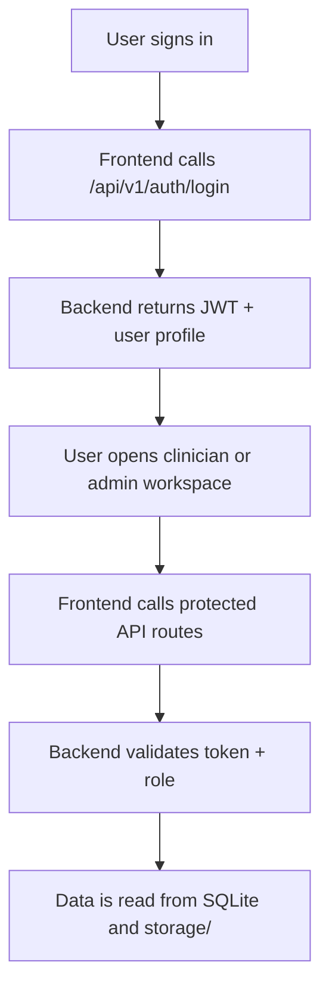
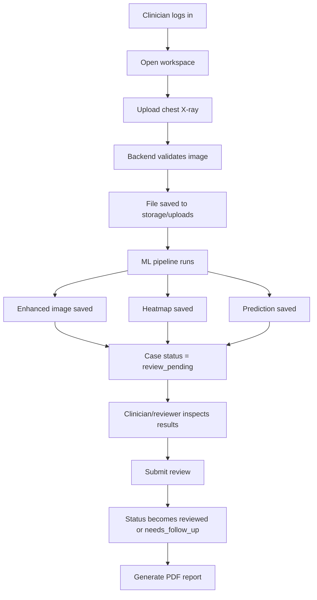
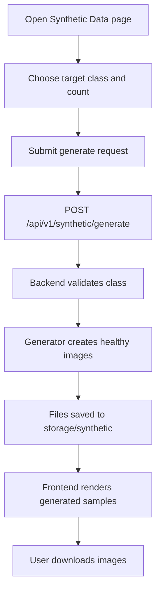
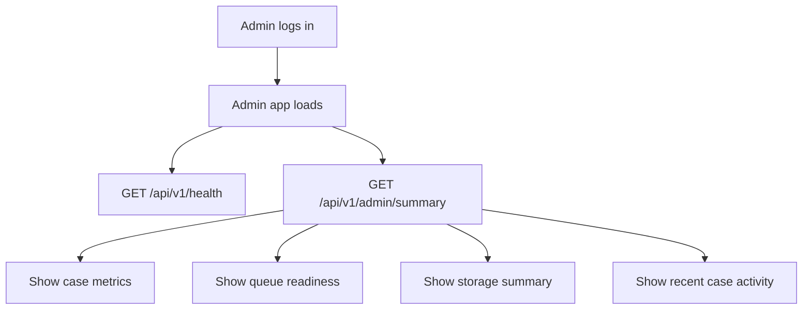
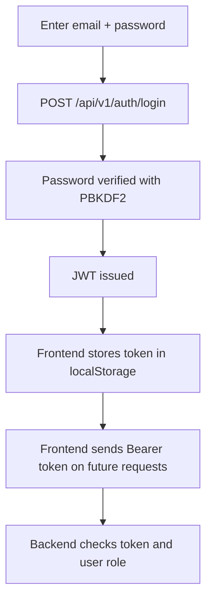
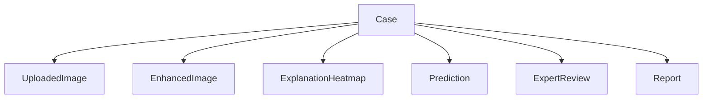
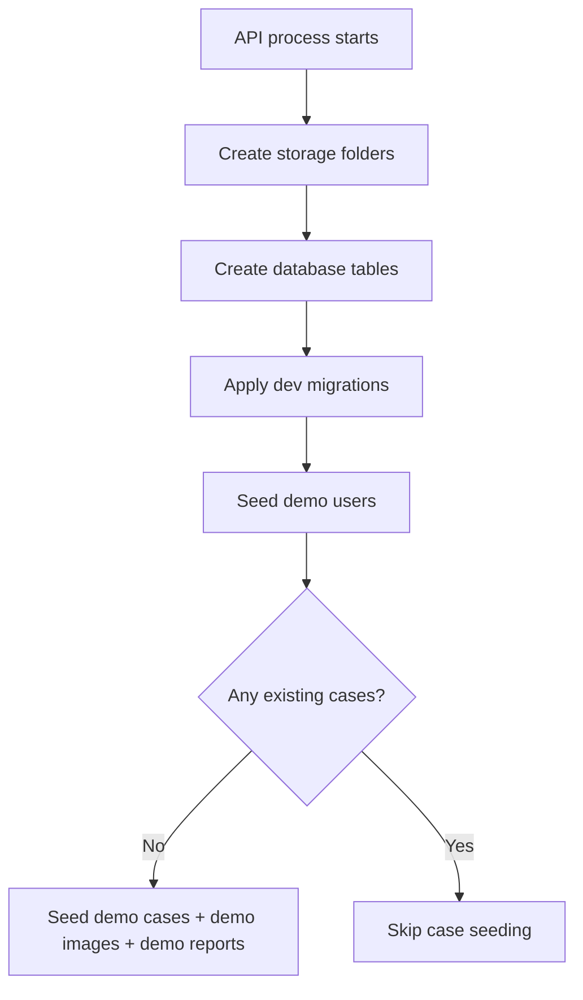

# AugMed Workflow

This document explains how the current AugMed MVP works from both the user and system perspective.

## 1. End-to-End System Flow

## 2. Clinician Workflow

### User flow

### Backend steps for upload

When `POST /api/v1/cases/upload` is called:

1. The API checks content type and file size.
2. Pillow verifies the image can be opened.
3. The file is saved to `storage/uploads/`.
4. The ML pipeline runs through `augmed_api.ml.pipeline`.
5. The pipeline creates:
   - an enhanced image in `storage/artifacts/`
   - a heatmap in `storage/artifacts/`
   - prediction metadata in the database
6. A `Case` row and related rows are saved:
   - `UploadedImage`
   - `EnhancedImage`
   - `ExplanationHeatmap`
   - `Prediction`
   - `Report` placeholder
7. The API returns the full case payload to the frontend.

### Review flow

When `POST /api/v1/cases/{case_id}/review` is called:

1. The API locates the case.
2. It creates an `ExpertReview` record.
3. It updates the case status:
   - `approved` decision -> `reviewed`
   - any other decision -> `needs_follow_up`
4. The updated case is returned to the frontend.

### Report flow

When `POST /api/v1/cases/{case_id}/report` is called:

1. The API gathers the latest upload, enhancement, heatmap, prediction, and review.
2. It renders a PDF report into `storage/reports/`.
3. The report record is marked as generated.
4. The PDF is returned to the browser for download.

## 3. Synthetic Data Workflow

### User flow

### Current implementation notes

- Supported target classes: `Healthy`, `Normal`
- Unsupported classes such as `Pneumonia` and `Tuberculosis` are rejected by the API
- The backend uses the bundled checkpoint at:
  - [normal_xray_generator.pt](/D:/FYP_Augmed/services/api/models/checkpoints/normal_xray_generator.pt)
- Generated files are written to:
  - [storage](/D:/FYP_Augmed/storage)

## 4. Admin Workflow

### Dashboard flow

The admin summary currently reports:

- total cases
- pending reviews
- active users
- ready reports
- queue backlog estimates
- per-folder storage counts
- recent case activity

### User management flow

When an admin uses the Users view:

1. `GET /api/v1/users` loads all users.
2. `POST /api/v1/users` creates a new user.
3. `PATCH /api/v1/users/{user_id}` updates role, active state, or password.
4. `DELETE /api/v1/users/{user_id}` removes a user.

These routes are admin-only.

## 5. Authentication Workflow

### Role model

Current seeded roles:

- `admin`
- `clinician`
- `reviewer`
- `researcher`

Route protection:

- case routes require any authenticated user
- synthetic routes require any authenticated user
- admin summary requires `admin`
- user management requires `admin`

## 6. Data Model Workflow

The most important entities are:

- `User`
- `Case`
- `UploadedImage`
- `EnhancedImage`
- `ExplanationHeatmap`
- `Prediction`
- `ExpertReview`
- `Report`

### Relationship flow

A single case accumulates artifacts and decisions over time, but the frontend mainly displays the latest record in each category.

## 7. Startup and Bootstrap Workflow

This is why a fresh local environment is immediately usable after starting the API.

## 8. Current Workflow Constraints

- Only local filesystem storage is implemented.
- SQLite is the default local database.
- No background worker or task queue is running yet.
- The clinician app includes placeholders for future sections.
- Synthetic generation is limited to healthy chest X-rays.
- Full production deployment workflow is not documented or implemented yet.

## 9. Recommended Next Workflow Improvements

- add environment configuration documentation
- introduce background jobs for heavier inference/report tasks
- split research workflows into a dedicated app or module
- document dataset ingestion and training lifecycle
- add audit logging workflow in more detail
